# The paramount battleships game
The paramount battleships game is a Python terminal game that runs on Heroku.
Battleship is a strategy type guessing game. It is known worldwide as a pencil and paper game which dates from World War I. And played on ruled grids where one player or each player has warships, which are hidden from the other player.

[Click here](https://paramount-battleships-game.herokuapp.com/) to play the game!

## How to play
---
The ultimate goal is to destroy all the ships from the other player.
There are a few variations of this game. 
This one has one game board where the computer places 4 ships at a random location.
The player has to fill in 2 coordinates between 1 and 5 and guesses where the ships are located. 

An 'M' is printed on the board if the player misses.
An '$' is printed on the board when the player sunk a ship.

When all the ships sank, the player wins.
When the player runs out of bullets, the player loses. 

## Features
---

- It starts with a quick welcome message followed by the question if the player wants to read the rules.

- If answered 'y' the rules are being displayed before continuing.
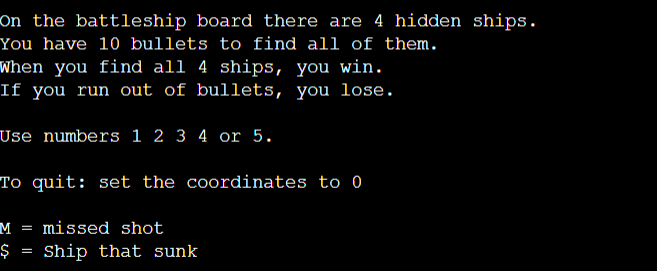

- If answered 'n' the game will continue and the player will be asked to create a username.
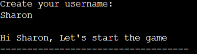

- If the player does not fill in a username, he is asked again to create one until a name is filled in.
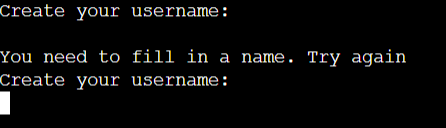

- After filling in a username, the game board will be shown.
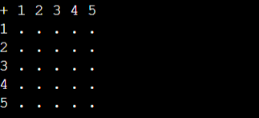

- Then will be asked to give 2 coordinations to hit the ships.
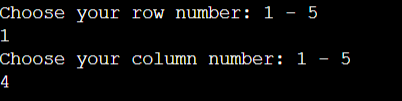

- If these are correct, an '$' will be printed on the board to locate the sunken ship.
Also the 'Sunken ships' variable will increse with 1 each time. And the 'bullets left' variable will decrease with 1 each time.

- If the coordinates are incorrect, an 'M' will be printed on the board to display the missed bullets.

- When all 4 ships sank, the player wins the game.

- When the player ran out of bullets before hitting all the ships, the player loses.

- When the player want to quit the game while playing, the 0 coordiates have to be given. Then the game will quit and clear the terminal.
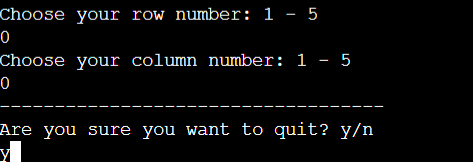

- After winning or losing, the player is asked if he wants to play again. 'Y' results in a new game with an empty terminal without previous game data. 'N' quits the game. 

## Features left to implement
---
- I want the player to be able to play against several players. Like the computer and even an extra player. So everyone has his own board (2 or 3 game boards in total) instead of 1 like right now.

- I want to make sure no ships can be placed twice on the same coordinations. I mentioned this below at the Unsolved Bugs.

- I want the user to place the ships themselves and choose different sizes of the ships.

- I want to create several difficulty levels by expanding the game board.

- Due to a time limit, I could not implement more use of colorama. I want to do this in the future to make the game look more appealing.

## Data Model Design
---
I created a flow chart with [Lucid Chart](https://www.lucidchart.com/) to lay out the flow of the game.

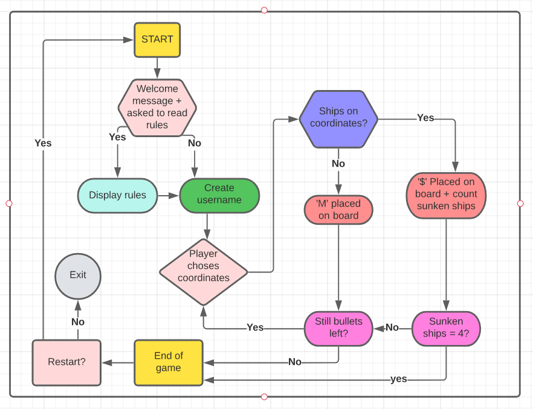
## Libraries
---
- random
    - The random library was imported to access the built-in method of generating a random number selection using the randint() method. 
- os
    - The os library was imported to create a function to utilise the os.system to clear the terminal.
- sys
    - The sys library was imported to create a function to restart the program so that previous data would not be used when restarting the game.
    It is also used to create a function to exit the game while playing.
- colorama
    - The colorama library was installed to give color to several statements.

## Testing
---
### Validator
- No errors were returned when passing through the [Pep8 Validator](http://pep8online.com/)

### What I tested
---
- I checked if all different kinds of input (letters, numbers, symbols, spaces, nothing) were catched properly before displaying the rules. And I can confirm that this is correct. Only the right input will continue to display the rules or not.
    - 'y' will display the rules
    - 'n' won't display the rules and game will continue
    - All other input will be catched:

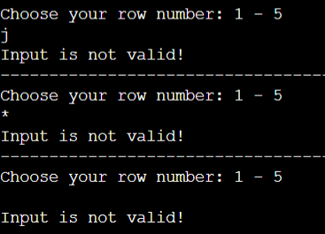

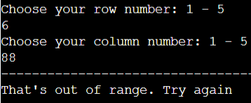

-  I confirm that the player can fill in a username to their liking. And if they do not fill in anything, he is asked again to create a username until an answer is given.

- I confirm that the battleship game board is dispayed correctly and is empty. There is no previous player data and the ships are hidden.

- I confirm that there are ships being placed on the board at a different location each time. Like mentioned in Unsolved Bugs, sometimes (not every game round) this function places 2 ships at the same location which results in losing the game.

- I confirm that when giving the coordinates, different kinds of input are catched.
    - Input above 5 is out of range
    - Letters or symbols are invalid
    - 0 quits the game, like mentioned in the rules. I tested that the quit game function actually stops the game and clears the terminal.
Only when the input is valid, the game will continue.

- Regarding input, I also tested that:
    - An 'M' is placed on the board when coordinates are incorrect.
    - An '$' is placed on the board when coordinates are correct.

- I confirm that the player wins when 4 ships have been hit. I tested the increment statement and each 'correct hit' iteration, it increments by 1. 

- I confirm that the player loses when he ran out of bullets. There is an decrement statement to keep track of the amount of bullets.

- I confirm that the restart game function works correctly.
    - It clears the terminal
    - It restarts the module so no previous data is being saved

- I confirm that the main function works correctly. It calls all other functions in the right order which results in a working game. 

## Issues And Bugs Found
---
When writing this game, I found several issues on the way that needed to be solved.
- Hiding the ships
    - When placing the ships ('X') on the game board, the ships were shown to the player. So he knew exactly where the ships were placed. I solved this by creating another game board so I have two boards in total. One where the ships are being placed on and one where the player's moves are being tracked. 
    Now the player is not able to see the hidden ships as the other board is being displayed. 

- Catching the input of the player correctly
    - When the given coordinates were bigger than 5, an error occurred saying the list index is out of range and this would break the game. 
    I solved this by writing the code below:

- When only one coordinate was given instead of two, and when a letter was given instead of a number, the game would break because of an error.
I solved this by using an try except statement within a while loop. See code below:

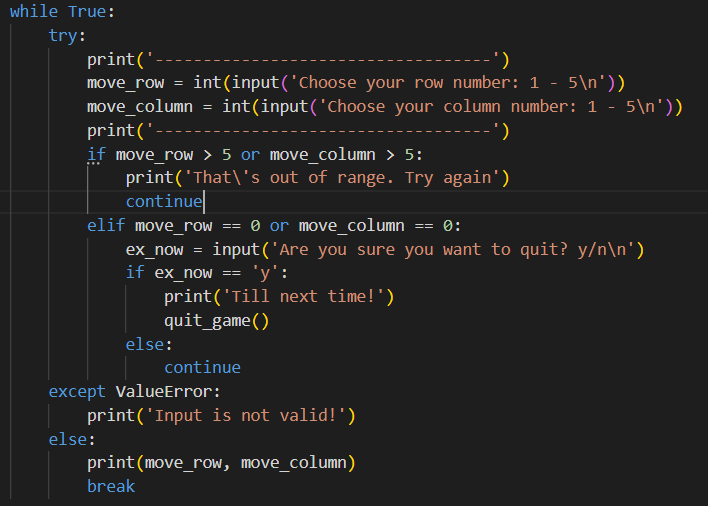

- The restart function would restart the game but would not reset the game boards. So the moves of the previous game were displayed.
I created another function to clear the screen and restart my python module so that the game board is empty when restarting the game.

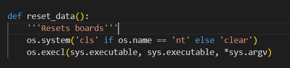

### Unsolved bugs
---
- Sometimes the ship placement function places only 3 ships instead of 4. 
This function choses a random integer between 1 and 4 within a for loop of range 4. It should place 4 ships at a random location each time the function is called. And it is placing the ships correctly most of the time. Just so now and then (not every game round) it places only 3 ships because 2 coordinates are the exact same. 2 Ships are placed on the same coordinates.
I want to solve this by using an extra if statement or an try except statement. So far I haven't had time yet and will leave this for features left to implement in the future.

## Deployment
---

1. Log in to Heroku or create an account.
2. Then, click the button labelled New from the dashboard in the top right corner and from the drop-down menu select Create New App.
You must enter a unique app name.
3. Next, select your region.
4. Click on the Create App button.
5. The next page you will see is the project’s Deploy Tab. Click on the Settings Tab and scroll down to Config Vars.
6. Click Reveal Config Vars and enter PORT into the Key box and 8000 into the Value box and click the Add button.
7. Next, scroll down to the Buildpack section click Add Buildpack select python and click Save Changes.
8. Repeat step 8 to add node.js. o Note: The Buildpacks must be in the correct order. If not click and drag them to move into the correct order.
9. Scroll to the top of the page and now choose the Deploy tab.
10. Select Github as the deployment method.
11. Confirm you want to connect to GitHub.
12. Search for the repository name and click the connect button.
13. Scroll to the bottom of the deploy page and select preferred deployment type:
- Click either Enable Automatic Deploys for automatic deployment when you push updates to Github.

- Select the correct branch for deployment from the drop-down menu and click Deploy Branch for manual deployment.
## Credits
---
Resources I used to get a better understanding of Python 3:

- [Docs Python](https://docs.python.org/3/library/random.html) - Helped me understand the randint.

- [Geeks for Geeks](https://www.geeksforgeeks.org/reloading-modules-python/) - Helped me understand how to reload a file.

- [Code Grepper](https://www.codegrepper.com/code-examples/python/restart+python+script+automatically) - Helped me understand the sys library

- [w3schools](https://www.w3schools.com/python/python_try_except.asp) - Taught me how the try and except statements work.

- [Stackoverflow](https://stackoverflow.com/questions/19747371/python-exit-commands-why-so-many-and-when-should-each-be-used) - Taught me how to use the exit statement of the sys library.

Other:

- [Wikipedia](https://en.wikipedia.org/wiki/Battleship_(game)#:~:text=The%20game%20of%20Battleship%20is%20thought%20to%20have,played%20by%20Russian%20officers%20before%20World%20War%20I) - Taught me a bit more about the battleship game which I was not familiar with

- [Medium](https://medium.com/@saumya.ranjan/how-to-write-a-readme-md-file-markdown-file-20cb7cbcd6f) - Reminded me of how to write a ReadMe in markdown.

- [Github](https://github.com/ciaraosull/project-3-mastermind) - I used the structure of this Readme file of a fellow student for my own ReadMe file.

- [Google Translate](translate.google.com) - This website was very useful for translating from Dutch to English.

Credits and big thanks to my mentor Daisy, tutor support and the channels and students on Slack. 